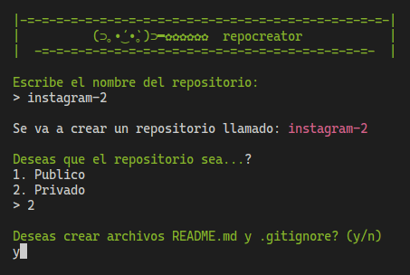

# repo-creator

Este script sirve para crear repositorios remotos directamente desde la consola. <br><br>
Github removió la posibilidad de autenticarse con contraseña, por lo que ahora es **necesario** tener un [token personal](https://docs.github.com/en/authentication/keeping-your-account-and-data-secure/creating-a-personal-access-token) de autenticacion.

## instalación
```sh
curl -OLs https://raw.githubusercontent.com/d1lanX/repo-creator/main/repocreate.sh && sh repocreate.sh
```

## screenshot
